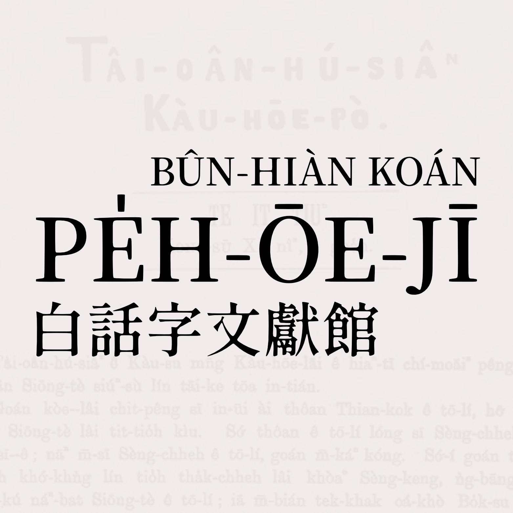

## 基本紹介

### 白話字
台語Pe̍h-ōe-jī（白話字）是台語頭1 ê正寫法（chèng-siá-hoat，orthography），也就是完整、標準化ê書寫系統（writing system）。

受19世紀基督教新教影響，世間文字得tio̍h大發展，台灣也無lia̍h外。1865年英國長老教會宣教師來台灣，教台灣人學白話字。1970年馬雅各批信有寫講，tī打狗內門木柵教查某人學白話字，1日學6點鐘久。（資料來源：[白話字的起源與在台灣的發展（陳慕真教授論文）](https://www.ntl.edu.tw/public/ntl/4216/%E9%99%B3%E6%85%95%E7%9C%9F%E5%85%A8%E6%96%87.pdf){:target="_blank"}）

1885年發行台灣頭1份報紙「Tâi-oân Hú-siâⁿ Kàu-hōe Pò（台灣府城教會報）」（taⁿ改名做「台灣教會公報」）了後，白話字藉教會kap媒體傳播ê力量，得tio̍h發展ê機會。其他民間組織像「台灣文化協會」、「霧峰一新會」等等mā有chhui-sak beh全面tek普及化。

[台語文學發展史資料庫（台灣文學館）](https://db.nmtl.gov.tw/site3/index){:target="_blank"}內底寫講：「巴克禮創辦白話字報紙《Tâi-oân Hú-siâⁿ Kàu-hōe-pò》（台灣府城教會報），稱台灣新文學ê起點。」

白話字文獻是台語文獻內底數量上chē--ê，時間ùi清國時代到戰後，siáⁿ-mih款ê內容、文類lóng有。而且使用者真chē是一般社會大眾，m̄是文人。除了報紙，也有真chē作品、冊出版。

因為日本時代殖民者禁止咱發展ka-tī ê文字，戰後中華民國時代有全民義務教育了後，到taⁿ mā是殖民語文做教育主體，長期禁止、打壓白話字。所致，一般社會大眾根本m̄知影台語有文字、有文獻。
{: .notice--warning}

### 白話字文獻館
Chit ê網站ùi白話字文獻內底摘beh kah 3000篇文章，koh ke-thiⁿ漢羅版對應，hō͘初學者khah快讀，了解白話字文獻ê內容kap重要性。Mā是方便現此時台語文學習者、教育者、研究者，了解咱ê語文資產。

咱chia「白話字文獻館」收錄--ê單單全白話字--ê，也就是1969年「台灣教會公報」全白話字版hông禁止進前--ê。內容來源是《台灣教會公報》kap《芥菜子》，其他出版--ê無收。近代--ê請看「[台文通訊](https://taibunthongsin.taigi.info/){:target="_blank"}」、「[台灣教會公報](https://home.pctpress.org/){:target="_blank"}（台文版）」，大部份是漢羅lām寫。

原網站koh有整理1 kóa圖片，咱chia無處理，單單處理數位文字資料。

感謝[原網站團隊](https://bunhiankoan.poj.tw/2010/script/members.htm){:target="_blank"}，hō͘咱有chiah ê資源thang利用。🙏

因為內容iáu是bē少，真推薦初學者先看下底「入門參考資料」，才來讀網站內底ê文章。
{: .notice--success}

### 讀看māi

- 台語頭1篇小說，mā是寓言故事，勸人m̄ thang厚khiàn-sńg、貪心！😵
  - [日本ê怪事](../1886-01/%E6%97%A5%E6%9C%AC%C3%AA%E6%80%AA%E4%BA%8B/)
- Cinderella tī 1915年已經有台語版，i有1 ê台灣名號做寶善姑娘！👩‍🦰
  - [塗炭仔](../1915-09/%E5%A1%97%E7%82%AD%E4%BB%94/)
- 新聞報導Titanic船lòng tio̍h冰山，內底有金條？💰
  - [攻破大船](../1912-06/%E6%94%BB%E7%A0%B4%E5%A4%A7%E8%88%B9/)

## 入門參考資料

### 影片

- [漢字之外—台語「白話字」ê世界／陳慕真](https://www.youtube.com/watch?v=sS5uqqK-3sg&list=PLY6hOIPHm4CT5cv9GbChCt7_ZJLjvwtLq&index=3){:target="_blank"}
- [台語白話字是台灣新文學ê開基祖／蔣為文](https://www.youtube.com/watch?v=90upiYlEOXw&list=PLY6hOIPHm4CT5cv9GbChCt7_ZJLjvwtLq&index=4){:target="_blank"}
- [台語白話字作家kap作品導讀／蔣為文](https://www.youtube.com/watch?v=0Azk46Y5IOY&list=PLY6hOIPHm4CQnTCyRnkiugYY-g50fl7ay&index=2){:target="_blank"}
- [日本時代ê台語白話字文獻kap文學／陳慕真](https://www.youtube.com/watch?v=tst7Sv1u-IY&list=PLY6hOIPHm4CSptdd0lcjtFxQFfIGevU7a&index=2){:target="_blank"}
- [戰後台語白話字文獻kap文學／陳慕真](https://www.youtube.com/watch?v=t32s81A2JOw&list=PLY6hOIPHm4CSptdd0lcjtFxQFfIGevU7a&index=3){:target="_blank"}
- [戰後台語白話字ê文學發展／蔣為文](https://www.youtube.com/watch?v=6O33PTrWobw&list=PLY6hOIPHm4CQnTCyRnkiugYY-g50fl7ay&index=1){:target="_blank"}

### 冊

- [探索台語白話字的故事（台灣文學館）](https://www.nmtl.gov.tw/publicationmore?uid=176&pid=2159){:target="_blank"}
- [台語白話字文學選集（台灣文學館）](https://www.nmtl.gov.tw/publicationmore?uid=176&pid=1844){:target="_blank"}
- [台灣文學ê金璇石──1920年進前台語白話字文學經典文選（成功大學台灣語文測驗中心）](https://www.atsiu.com/product_1638424.html){:target="_blank"}
- [白話字的起源與在台灣的發展（陳慕真教授論文）](https://www.ntl.edu.tw/public/ntl/4216/%E9%99%B3%E6%85%95%E7%9C%9F%E5%85%A8%E6%96%87.pdf){:target="_blank"}

### 網站

- [台語文學發展史資料庫（台灣文學館）](https://db.nmtl.gov.tw/site3/index){:target="_blank"}
- [白話字數位典藏博物館](https://db.nmtl.gov.tw/site3/home){:target="_blank"}
- [台灣教會公報（1885~1967全白話字版）數位化](https://minhakka.ling.sinica.edu.tw/bkg/ke-si/khoann-chheh.php){:target="_blank"}
  - [全文檢索](http://minhakka.ling.sinica.edu.tw/bkg/choan-bun-kiam-sek.php?gi_gian=hoa){:target="_blank"}
  - [文獻檢索](http://minhakka.ling.sinica.edu.tw/bkg/bkg.php?gi_gian=hoa){:target="_blank"}

### 文字教學

- [狗公會曉學台語](https://oh.taigi.info/){:target="_blank"}
- [島嶼ê台語車幫 台語白話字基礎發音](https://www.youtube.com/playlist>?list=PLS1s7edHAnhau1ZYuJCDLCZllzNmMqwds){:target="_blank"}
- [台南妹仔教你講台語《來學台語白話字》](https://www.youtube.com/playlist?list=PLxpdI6PlRbFfEgZlts7p-otEABnoKsb1j){:target="_blank"}
- [阿勇台語 線頂羅馬字課程](https://www.youtube.com/playlist?list=PLTSKFutIq9d3nfUWJ0LyuTfl6TI5EtT4W){:target="_blank"}
- [阿勇台語 Tâigí Phonics](https://www.youtube.com/playlist?list=PLTSKFutIq9d1YCzD8RgIjpGsR9R34-BLt){:target="_blank"}
- [THK 白話字基礎](https://www.youtube.com/playlist?list=PL_G_Ob084WFpe8MtRKj3Aop-i4fvMwlEC){:target="_blank"}

## 原網站資訊

請參考[原網站khó͘-phih](https://bunhiankoan.poj.tw/2010/){:target="_blank"}，下底kan-na摘khah重要--ê。

### 計劃簡介（中文）

《台灣教會公報》自其前身《台灣府城教會報》於1885年創刊以後，至1969年改為華文出刊為止，84年間所累積的以台語白話字所書寫之史料著實相當豐富。然而這批豐富且珍貴的史料目前被學界的運用仍相當有限，除了資料取得不易之外，缺乏白話字教育及理解能力亦是重要因素。雖教會公報社已出版70冊《台灣教會公報全覽》，但資料龐雜，雖已有民間工作者從事初步整理與部份數位化，但在教育及推廣上仍在少眾環境使用。本計劃在前人研究之基礎上，將《台灣教會公報》中之文學作品，包含議論文與報導文學揀選出來，將內容延伸建置為「台灣白話字文獻資料館」，以供台灣文學研究者更加充足而完整的白話字文學相關資料，補足台灣文學之歷史質量，以利於台灣本土相關研究之發展。

關於白話字的使用，尤其在清國中期、末期，乃至民國初期年間，亞洲地區如中國南方、越南、日本、韓國、新加坡、菲律賓等地，都有使用「羅馬字」拼寫地方語言的歷史及文獻；在台灣，早期即稱「白話字」（Pe̍h-oē-jī）或「羅馬字」，並延用至今。目前為止，仍有繼續使用這個文字書寫，並發展出地方語言特色者，台灣是少數國家之一。

本計劃的執行成果，除計劃團隊分工，揀選《台灣教會公報》內容打字、翻譯、校對、上稿，為主要計劃工作之外，亦將2007年出土之「北部台灣教會公報」《芥菜子》第1-22期，以及戰前白話字相關出版品數位化，以影像方式呈現，並將部份《芥菜子》內容數位化及漢羅翻譯，同置於文獻資料庫中，提供瀏覽者更方便的檢閱查詢與利用。待資料庫的文字及影像內容都累積達到相當程度，期待做為一個亞洲級、世界級的白話字文獻數位典藏區。

### 典藏特色（中文）

整體而言，「台灣教會公報（1895-1969）白話字文獻數位典藏計劃」所建置的「台灣白話字文獻資料館」之典藏資料，具備以下主要四項特色：

一、《台灣教會公報》文獻數位化的突破：

歷年在少數有心學者及民間人士的努力下，搶救白話字文獻、分析《台灣教會公報》白話字文學史料的工作，已累積一些成績，可惜仍少為各界利用。即便許多資料或相關研究已由私人架構之網站呈現，然而，囿於白話字知識教育未普及、網站資料有限，使得版面未能盡美，有興趣上網閱讀資料者，猶在少數。適由國科會數位典藏計劃支持，本計劃除了原訂將文獻分類整理之外，亦商請台灣教會公報社、台灣基督教長老教會總會、台灣基督長老教會教會歷史委員會、北部台灣基督教長老教會史蹟委員會（真理大學牛津學堂）、淡江中學校史館等單位，提供珍貴歷史影像及文字資料之授權，充實本網站的內容，也讓使用者得以在閱讀白話字文獻之外，更直接獲得、感受這批史料背景之下的台灣、台灣人事物的樣貌。

由教會公報出版社出版之《台灣教會公報全覽》已付梓發行，教會公報中有相當龐大的史料待吾人整理與利用，隨著網路時代的進步，白話字文獻數位化的工作亟待加緊腳步。而目前白話字文獻數位化的資料仍有限，也礙於現今報社已幾乎全面中文化，而缺乏人力得以將這批資料做完整的數位化。而本計劃除了原來的文字部分之外，更將白話字文字、文學以及信仰、刊物都能在地化的推動者巴克禮牧師，以及揀選其他同時代對台灣母語文獻有所貢獻者（包括西方傳教士及台灣在地傳道者與信徒）、文學創作者等重要人士，也一併置於本網站供使用者延伸閱覽。另外，也將相關建築、傳道事務、印刷機器及製版文物等照片，置於系列介紹及連結。

二、豐富多元的語言、歷史、文化資料：

由英國長老教會（The Presbyterian Church of England）的宣教士巴克禮（Thomas Barclay，1849-1935）牧師於1885年創辦的《台灣府城教會報》（今《台灣教會公報》前身），歷經清領末期、日本時代、國府時期等三個朝代，迄今仍持續發刊，為全台灣最早發行且發刊最久的報紙。創刊時的用字，採清季長老教會內部通用已久的廈門音羅馬字（白話字）刊印；至1969年才因國民政府禁令而停止以白話字，改以中文刊行。

由於教會公報的白話字拼寫，乃為因應傳教士學習廈門語所需而發展的產物。傳到台灣後，除沿襲清國時代中國南方一帶與當時的台灣話口音，也在台灣的日本時代，將受日本殖民語影響後而新生的台灣話詞語，如實地不受「假名」（不同於漢文）的限制，拼寫出所謂的「日式台語」發音。從創刊號一路看到戰後初期的教會公報，除了主要以白話字書寫台語之外，也書寫台灣本地的客家語、原住民語；且其中語言的語法、形式受到不同統治者推行的語文教育，而有明顯變化。

《台灣教會公報》自創刊以來，刊載的事項主要包括：1.教會消息　2.聖經教義闡釋　3.教育、醫療事業動態　4.社會時事等，而其中也不乏文學作品的創作，例如詩歌、散文、小說、戲劇，報導文學、旅遊文學等，與台灣、中國、西方的社會進程，相較於同時代的刊物，更能同步甚至超前而多元。除了語言上的貢獻，白話字文獻中的觀點，於歷史上見證同時代、同事件中，不同的社會視角；而也由於作為傳教工具的關係，書寫的內容與殖民主對待在地文化、弱勢族群（平如平埔族、高砂族）的態度有更明顯而積極的關懷。

三、：影像與文獻結合，增進文史教學的興味與互動

《台灣教會公報》中的白話字文獻並未全數上網，本計劃僅將廣義的文學類（包括詩、散文、雜文、小說、報導、戲劇等）作品作數位化處理；並將台灣基督教長老教會歷史背景、圖像置於數位資料館中，期使未來的台灣文學、台灣歷史、台灣語文的相關教學，能有更多輔助教材。而對於白話字有興趣的研究者，可透過相關歷史影像而對白話字的時代環境有更深刻的印象與了解。影像與文獻的結合，也提供更多教學範本及教材，讓白話字的學習更能進入歷史的情境中。

數位化處理主要分為二個階段，第一階段先將選取出的白話字文獻重新打字，同步進行的另一階段則是將打字後的文章做「漢羅台語」的翻譯，以對照的方式呈現在網站上，讓使用者得以更加容易而便利地閱讀文章內容。

本網站尚包含檢索功能及討論區，我們將每篇白話字文獻析出關鍵詞，提供使用者更細緻的檢索需求（主要先以漢字模式搜尋為主），希望開啟更多白話字文獻相關議題之討論空間以研究視角。

四、白話字新史料出土

《台灣教會公報》自1928年1月以降，直接以「Pak-pō͘ Sū-bū」（北部事務）的專欄刊載《KOÀ-CHHÀI-CHÍ》（芥菜子）月報，並保留刊名，且接續期數（第23期）合刊《芥菜子》。《芥菜子》月報原創刊於1926年1月，刊物封面除了刊名之外，尚印有「PAK-PŌ͘ TÂI-OÂN KI-TOK TIÚⁿ-LÓ KÀU-HOĒ KÀU-HOĒ KONG-PÒ」（北部台灣基督長老教會教會公報）等字樣，似與在台南發行久矣的《台灣教會公報》頗有分庭抗禮之勢。創刊者兼發行人陳清忠長老，也是這份刊物的主筆；陳清忠在《芥菜子》第22期末頁，已預告刊物將與《台灣教會公報》合刊的消息。而到1937年8月第139號之後，《台灣教會公報》每月猶以「PAK-PŌ͘ TIONG-HOĒ」之名延續原《芥菜子》的期數於報刊中合印發行。

目前《台灣教會公報》漸漸被學界重視，研究者對教會公報中曾有數十期刊載《芥菜子》之事並不陌生，但由於創刊號至22期沒有完整出土，則少有對這份刊物較歷史性及系統性的研究，乃至也未有《芥菜子》與《台灣教會公報》之間的異同及連結性之分析。

本計劃執行過程中的一個重大發現，即在收集相關史料時，找到《芥菜子》前22期合訂本（收藏於淡水中學校史館之陳清忠先生遺物櫃，推測應由陳清忠牧師本人手工製成的合訂本）。這個重大的史料出土，不僅文獻上的資料意義本身有所增加，由於原來長老教會在南北未完全合作的狀況下，《芥菜子》的發行，有助於我們更了解北部教會的更迭，以及傳道者們的思考。特別是《芥菜子》發行人為被譽作台灣「橄欖球之父」、「合唱團之父」的陳清忠先生，刊物中更有其文學創作（包括小說、論述、翻譯，甚至是音樂創作等等），這些作品刊於1926-1927年間，其時代意義則更加深遠，可期未來在台灣文學史上有突破性的觀點論述。

而在陳清忠遺物中尚有《傳道師會會誌》第二回及第四回被保存下來，雖僅兩期，但其中的文獻內容極其豐富。本典藏資料雖人力物力不足，但亦會將這些新出土的史料做初步的典藏，開啟更多對白話字有興趣的研究者及民眾得以見證歷史的機會。
